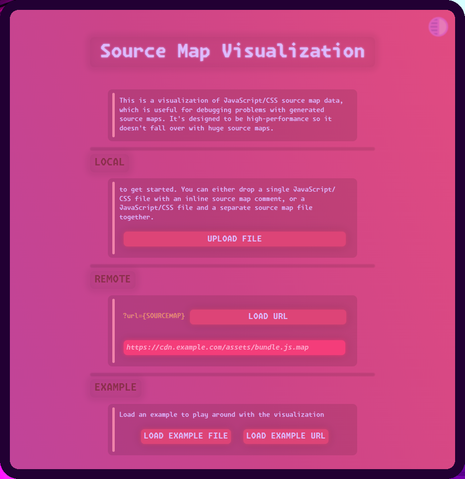
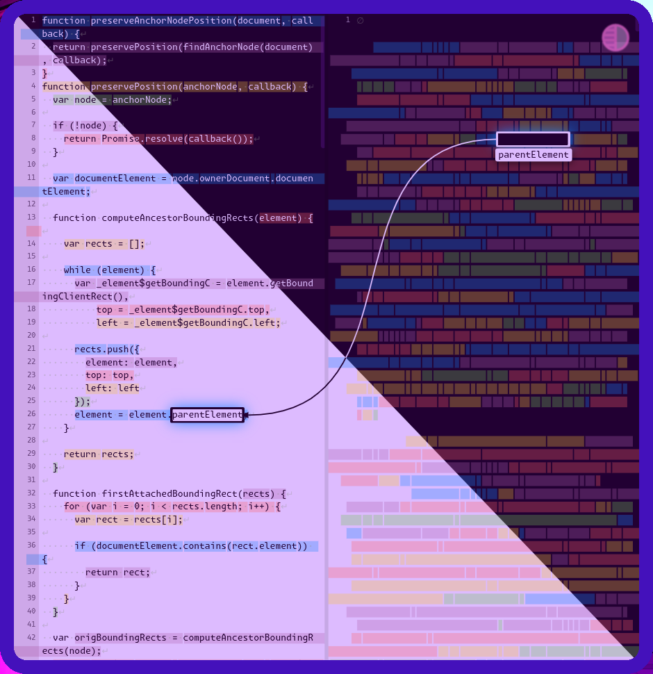

# Source Map Visualization

   
  

---

> [!CAUTION]
> ☢️ THE CODEBASE IS CURSED 
>
> ⛔ AVOID EYE CONTACT WITH [code.js](https://github.com/metaory/source-map-visualization/blob/gh-pages/code.js)
> 
> CONTINUE AT YOUR OWN RISK 

---

## FORK NOTES

- added `url` query string to load remote files
- refactored the hellscape of code.js just a bit
- removed old url hash implementation
- removed statusbar and toolbar
- removed file drop

#### Demo

[metaory.github.io/source-map-visualization](https://metaory.github.io/source-map-visualization)

#### Remote URL 

[metaory.github.io/source-map-visualization/?url={REMOTE-URL}](https://metaory.github.io/source-map-visualization/?url=https://github.githubassets.com/assets/settings-fe0ee97d5327.js.map)

Example:

`https://github.githubassets.com/assets/settings-fe0ee97d5327.js.map`

[metaory.github.io/source-map-visualization/?url=https://github.githubassets.com/assets/settings-fe0ee97d5327.js.map](https://metaory.github.io/source-map-visualization/?url=https://github.githubassets.com/assets/settings-fe0ee97d5327.js.map)

---

> ## OLD README
> Demo: [https://evanw.github.io/source-map-visualization](https://evanw.github.io/source-map-visualization)
>
> This is a visualization of JavaScript/CSS source map data, which is useful for debugging problems with generated source maps. It's designed to be high-performance so it doesn't fall over with huge source maps.

---

## CONTRIBUTORS

- [@evanw](https://github.com/evanw)
- [@metaory](https://github.com/metaory)

## LICENSE

MIT @ [Evan Wallace](https://github.com/evanw)
